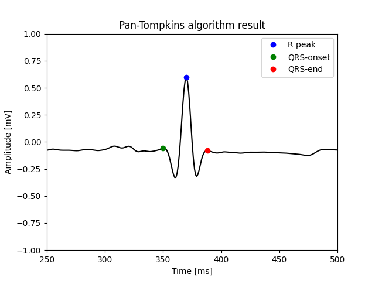

# ECG_WAVES

This repo is part of the ECG-Analyzer project. It contains a python implementation of an algorithm to detect characteristic ECG points. 

## [Pan-Tompkins algorithm](https://github.com/Swedeling/ECG_WAVES/blob/main/modules/R_detection.py) 

The following points were detected: QRS-onset, QRS-end, R-peak. 

Result of the analysis: 

